```mermaid
flowchart TB
    subgraph current["Ahnenforscherin.csproj"]
        MAIN["<b>📦&nbsp;Ahnenforscherin.csproj</b><br/><small>net8.0-windows10.0.19041.0</small>"]
        click MAIN "#ahnenforscherinahnenforscherincsproj"
    end

```

# Projects and dependencies analysis

This document provides a comprehensive overview of the projects and their dependencies in the context of upgrading to .NETCoreApp,Version=v10.0.

## Table of Contents

- [Executive Summary](#executive-Summary)
  - [Highlevel Metrics](#highlevel-metrics)
  - [Projects Compatibility](#projects-compatibility)
  - [Package Compatibility](#package-compatibility)
  - [API Compatibility](#api-compatibility)
- [Aggregate NuGet packages details](#aggregate-nuget-packages-details)
- [Top API Migration Challenges](#top-api-migration-challenges)
  - [Technologies and Features](#technologies-and-features)
  - [Most Frequent API Issues](#most-frequent-api-issues)
- [Projects Relationship Graph](#projects-relationship-graph)
- [Project Details](#project-details)

  - [Ahnenforscherin\Ahnenforscherin.csproj](#ahnenforscherinahnenforscherincsproj)

## Executive Summary

### Highlevel Metrics

| Metric | Count | Status |
| :--- | :---: | :--- |
| Total Projects | 1 | All require upgrade |
| Total NuGet Packages | 3 | 1 need upgrade |
| Total Code Files | 66 |  |
| Total Code Files with Incidents | 12 |  |
| Total Lines of Code | 2713 |  |
| Total Number of Issues | 51 |  |
| Estimated LOC to modify | 49+ | at least 1,8% of codebase |

### Projects Compatibility

| Project | Target Framework | Difficulty | Package Issues | API Issues | Est. LOC Impact | Description |
| :--- | :---: | :---: | :---: | :---: | :---: | :--- |
| [Ahnenforscherin\Ahnenforscherin.csproj](#ahnenforscherinahnenforscherincsproj) | net8.0-windows10.0.19041.0 | 🟢 Low | 1 | 49 | 49+ | WinForms, Sdk Style = True |

### Package Compatibility

| Status | Count | Percentage |
| :--- | :---: | :---: |
| ✅ Compatible | 2 | 66,7% |
| ⚠️ Incompatible | 0 | 0,0% |
| 🔄 Upgrade Recommended | 1 | 33,3% |
| ***Total NuGet Packages*** | ***3*** | ***100%*** |

### API Compatibility

| Category | Count | Impact |
| :--- | :---: | :--- |
| 🔴 Binary Incompatible | 0 | High - Require code changes |
| 🟡 Source Incompatible | 23 | Medium - Needs re-compilation and potential conflicting API error fixing |
| 🔵 Behavioral change | 26 | Low - Behavioral changes that may require testing at runtime |
| ✅ Compatible | 2172 |  |
| ***Total APIs Analyzed*** | ***2221*** |  |

## Aggregate NuGet packages details

| Package | Current Version | Suggested Version | Projects | Description |
| :--- | :---: | :---: | :--- | :--- |
| Microsoft.EntityFrameworkCore | 9.0.9 | 10.0.2 | [Ahnenforscherin.csproj](#ahnenforscherinahnenforscherincsproj) | NuGet package upgrade is recommended |
| Microsoft.Windows.SDK.BuildTools | 10.0.26100.7463 |  | [Ahnenforscherin.csproj](#ahnenforscherinahnenforscherincsproj) | ✅Compatible |
| Microsoft.WindowsAppSDK | 1.8.260101001 |  | [Ahnenforscherin.csproj](#ahnenforscherinahnenforscherincsproj) | ✅Compatible |

## Top API Migration Challenges

### Technologies and Features

| Technology | Issues | Percentage | Migration Path |
| :--- | :---: | :---: | :--- |

### Most Frequent API Issues

| API | Count | Percentage | Category |
| :--- | :---: | :---: | :--- |
| T:Windows.UI.Color | 19 | 38,8% | Source Incompatible |
| T:System.Uri | 15 | 30,6% | Behavioral Change |
| M:System.Uri.#ctor(System.String) | 11 | 22,4% | Behavioral Change |
| M:Windows.UI.Color.FromArgb(System.Byte,System.Byte,System.Byte,System.Byte) | 4 | 8,2% | Source Incompatible |

## Projects Relationship Graph

Legend:
📦 SDK-style project
⚙️ Classic project

```mermaid
flowchart LR
    P1["<b>📦&nbsp;Ahnenforscherin.csproj</b><br/><small>net8.0-windows10.0.19041.0</small>"]
    click P1 "#ahnenforscherinahnenforscherincsproj"

```

## Project Details

### Ahnenforscherin\Ahnenforscherin.csproj

#### Project Info

- **Current Target Framework:** net8.0-windows10.0.19041.0
- **Proposed Target Framework:** net10.0-windows10.0.22000.0
- **SDK-style**: True
- **Project Kind:** WinForms
- **Dependencies**: 0
- **Dependants**: 0
- **Number of Files**: 80
- **Number of Files with Incidents**: 12
- **Lines of Code**: 2713
- **Estimated LOC to modify**: 49+ (at least 1,8% of the project)

#### Dependency Graph

Legend:
📦 SDK-style project
⚙️ Classic project

### API Compatibility

| Category | Count | Impact |
| :--- | :---: | :--- |
| 🔴 Binary Incompatible | 0 | High - Require code changes |
| 🟡 Source Incompatible | 23 | Medium - Needs re-compilation and potential conflicting API error fixing |
| 🔵 Behavioral change | 26 | Low - Behavioral changes that may require testing at runtime |
| ✅ Compatible | 2172 |  |
| ***Total APIs Analyzed*** | ***2221*** |  |

